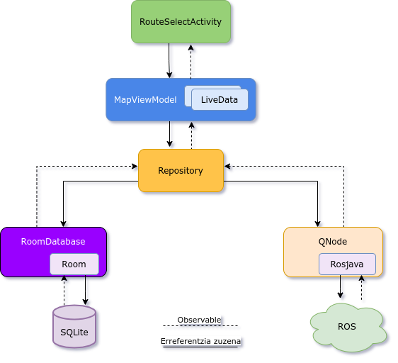
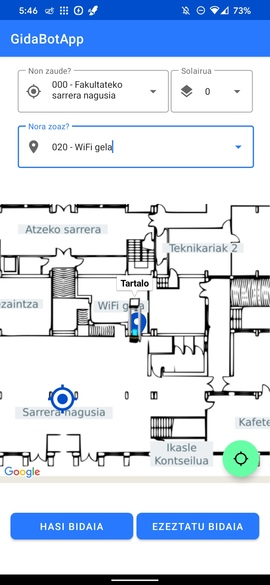

# GidaBotApp
 

This app is my Bachelor final project for my Bachelor's Degree in Informatics Engineering 
[@University of the Basque Country](https://www.ehu.eus/en/web/informatika-fakultatea).

Its main goal is to make an Android GUI for the [GidaBot](https://link.springer.com/article/10.1007/s11370-019-00285-8)
navigation-system developed by [RSAIT](http://www.sc.ehu.es/ccwrobot/) research group.

## What is GidaBot?
> GidaBot is an application designed to set up and run a heterogeneous team of robots to act as tour guides in multi-floor buildings. Although the tours can go through several floors, robots are not allowed to use the lift, and thus, each guiding task requires collaboration among several robots, one per floor. The designed system makes use of a robust inter-robot communication strategy to share goals and paths during the guiding tasks. A user-friendly GUI helps untrained users or new visitors to easily choose target locations or define a list of locations to be visited sequentially. A prototype has been implemented using ROS, and the system robustness has been tested in a Gazebo-based simulated robot/environment and using real robots at the Faculty of Informatics in San Sebastian. The whole application is available together with a simulated world so that the system functioning can be checked further.

## Features

- Built over MVVM Architecture
- It uses `rosjava_core` package to perform ROS<->Android communication
- It uses `android_core` package's [`RosActivity`](https://rosjava.github.io/android_core/latest/javadoc/org/ros/android/RosActivity.html) class to establish connection with ROS Master
- Multifloor navigation
- Material Design graphical interface
- Shows every Robot's position in a [map](./app/src/main/java/com/github/gidabotapp/view/RouteSelectActivity.java) (built over [GoogleMap](https://developers.google.com/maps/documentation/android-sdk/overview))

## Architecture

## Demo

## License

This program is free software; you can redistribute it and/or modify it under the terms of the GNU General Public License as published by the Free Software Foundation; either version 3 of the License, or any later version.

  